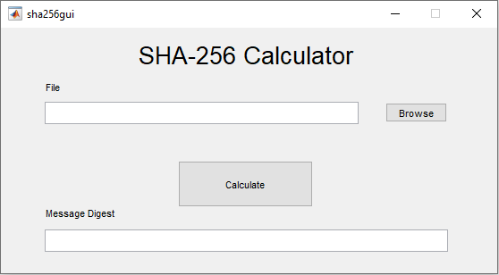

# SHA-256-Hash

## Terminal Version
Run sha256.m to take the hash of the file 'inputfile.txt' using the following command in MATLAB:

```
sha256('inputfile.txt')
```

You should see the following output:
```
Elapsed time is 0.007246 seconds.

ans =

    '6F722FDD1D265D07CF70BBEE7340E86F236DAAB4924BD1C4471FFC422E3B2B7C'
```

You can choose any file of your choice.

## Graphical Version



## References

https://csrc.nist.gov/csrc/media/publications/fips/180/3/archive/2008-10-31/documents/fips180-3_final.pdf

http://csrc.nist.gov/groups/STM/cavp/documents/shs/SHAVS.pdf

https://csrc.nist.rip/Projects/Cryptographic-Algorithm-Validation-Program/Validation/Validation-List/SHS
